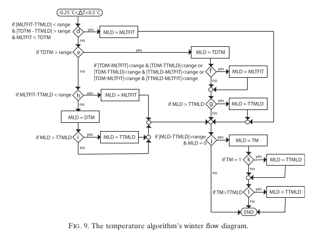
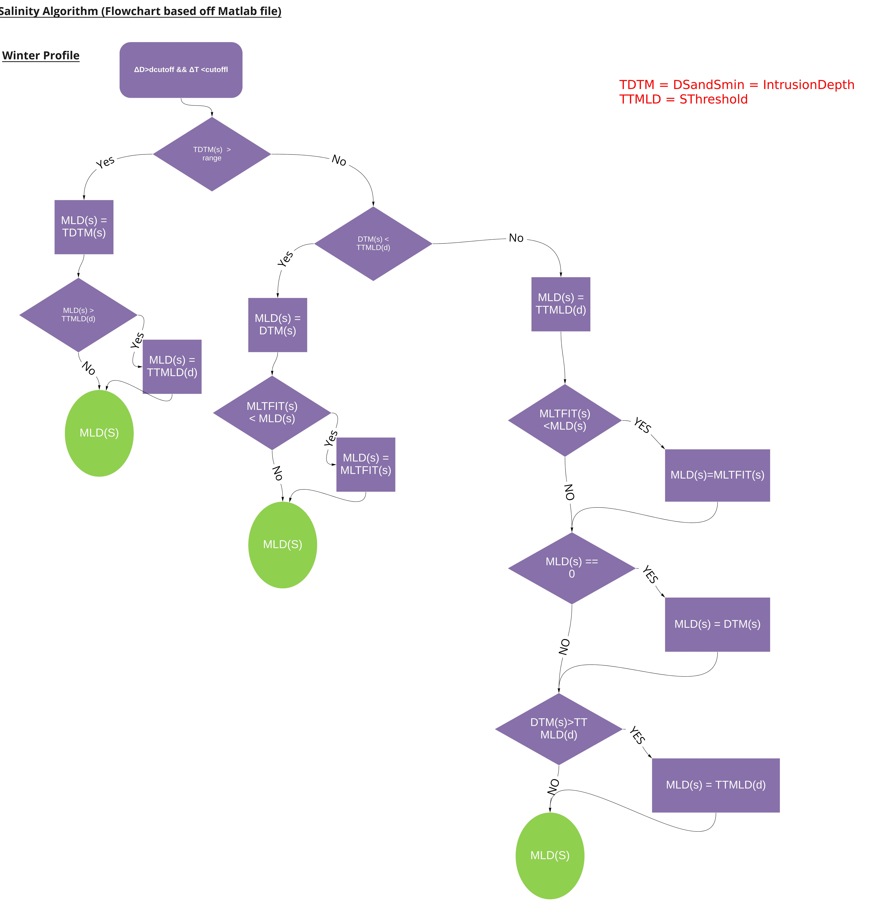
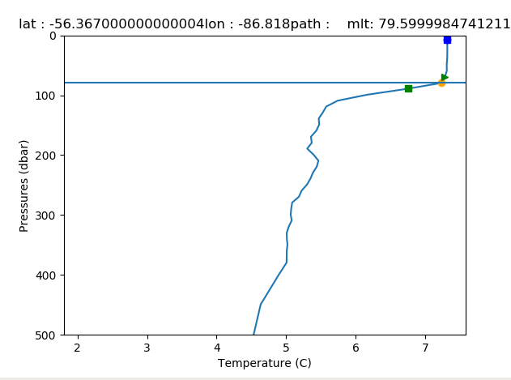
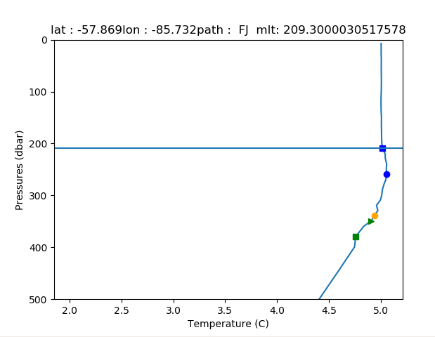

# Holte and Talley Mixed Layer Depth algorithm

This is a python port of the mixed layer depth algorithm outlined in [Holte and Talley 2009](http://mixedlayer.ucsd.edu/data/HolteTalley2009.pdf).

##Installation
To install from the pypi repository:

`pip install holteandtalley`

If you would like to install it from source in order to make changes:
```
#run this in the cloned repository
pip install -e .
```
this will allow you to `import holteandtalley` from anywhere on your machine, but any changes you make to the source will be immediately reflected.
##Usage
```
from holteandtalley import HolteAndTalley

 h = HolteAndTalley(pressures,temperaturess,salinities,densities)
 ##The temperature algorithms mixed layer depth
 h.tempMLD
 ##The salinity algorithms mixed layer depth
 h.salinityMLD
 ##The density algorithms mixed layer depth
 h.densityMLD
```
It is also possible to use only the temperature algorithm
```
from holteandtalley import HolteAndTalley

 h = HolteAndTalley(pressures,temperatures)
 ##The temperature algorithms mixed layer depth
 h.tempMLD
```
## The Temperature Algorithm
### Summer Flow Graph

### Winter Flow Graph


## The Density and Salinity Algorithms
The original paper does not include flowcharts for the density and salinity algorithms so I have included those below transcribed from the matlab supplementary materials provided.





## Glossary of Terms

## MLTFit

The MLTFit is defined as the interection of the line of best fit of the thermocline and the mixed layer. The best fit line of the thermocline is the line tangent to the profile at the point where d(T)/d(P) is the greatest. To determine the best fit line of the mixed layer, the algorithm calculates the best fit over progressively more points in the profile, calculates the error over the points included in the fit and then finds the deepest fit line which satisfies an error tolerance E<sub>T</sub> < 10<sup>-10</sup>.

## TTMLD

The deepest point in the profile which is less than 0.2C compared to the SST

## ΔT

T(i<sub>MLTFIT</sub>)-T(i<sub>MLTFIT+2</sub>)

## range

25 dbar

## TDTM

The minimum of the gradient maximum and the temperature maximum if that is less than 100 dbar. Otherwise it is set to 0

## DTM

Deepest point such that the gradient is less than 0.005 C/dbar or max if that criteria is not met.


## Some results




